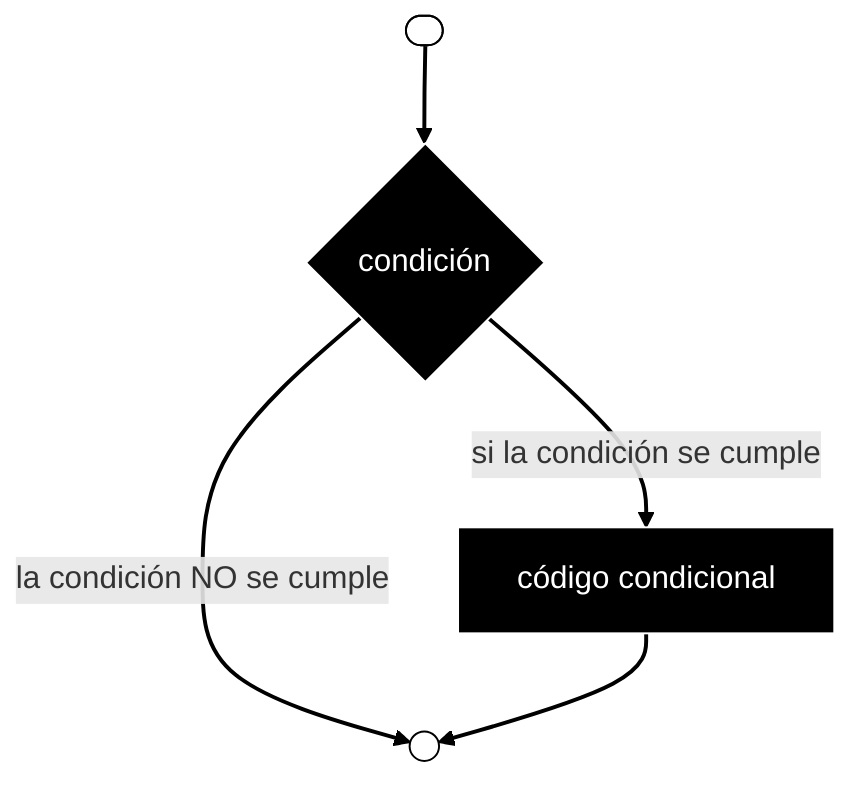

# Control de flujo

Las estructuras de toma de decisiones requieren que el programador especifique una o más condiciones que el programa debe evaluar o comprobar, junto con una o varias instrucciones que se ejecutarán si la condición se determina como verdadera y, opcionalmente, otras instrucciones que se ejecutarán si la condición se determina como falsa.

A continuación se muestra la forma general de una estructura de toma de decisiones típica.

**minipas** proporciona los siguientes tipos de sentencias de toma de decisiones:

- **Sentencia if-then**: Una sentencia if-then consta de una expresión booleana seguida de una o más sentencias.

- **Sentencia if-then-else**: Una sentencia if-then puede ir seguida de una sentencia else opcional, que se ejecuta cuando la expresión booleana es falsa.

- **Sentencias if anidadas**: Se puede utilizar una sentencia if o else if dentro de otra sentencia if o else if.

- **sentencia case**:

    ⚠️ **minipas** no admite case
